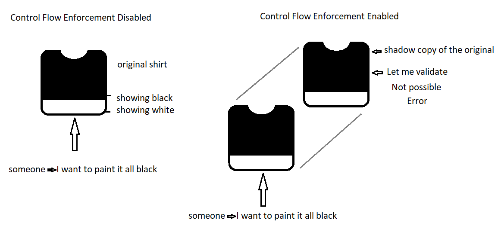

### dotnet-samples

## dotnet runtime

# control flow enforcement technology

New addition to the dotnet runtime which prompt compiled binaries against return oriented programming exploits. Good thing to have if security is a top priority in your low level software codebase (close to machine language). It has plenty of benefits and use cases in hardware firmware development, embedded systems software architecture, instruction set architecture, FPGA software development where software is very close to hardware like bare metal printed circuit boards for example. Enabling CET (Control Enforcement Technology) before compiling adds a shadow copy of the memory stack in low level return statement memory addresses which acts as an intermediary for validating the current flow execution of your program in cases where a malicious intender aims to get access to certain places where an extra instruction can be squeezed in by gaining unauthorized access to the current flow execution of the program and modify the intended purpose of the program.

Putting this in perspective we will exemplify an easy scenario where this can be applicable. Imagine you are a wearing a black shirt with a thick white line at the bottom and someone does not like to see that thick white line and wants to paint it all black. Now, without control-flow enforcement enabled, the shirt that you are wearing is vulnerable to be painted by someone else and change the looks of it. But, with CET enabled, now there exists a shadow of the original shirt and if someone tries to paint it all black, it is not possible because it does not pass validation. Lets put this in a picture to showcase it in other words.

Now we will create a relevant example where this new feature was intended to be more applicable to. We will add a buffer overflow example in Program.cs. It is important to note that in this example, the Buffer.BlockCopy method is used to copy the input string into a byte array. The Buffer.BlockCopy method does not check if the destination buffer is large enough to hold the entire input string. If the input string is longer than the buffer, the extra characters will overwrite the memory after the buffer, which can lead to a buffer overflow vulnerability.

To exploit this vulnerability, an attacker could provide a very long input string, which would cause the extra characters to overwrite the memory after the buffer by gaining control of the flow execution of the program. This could potentially allow the attacker to execute arbitrary code or manipulate the program's behavior.

**Again, please note that exploiting buffer overflows is illegal and can cause serious security issues. It's important to handle user input carefully and validate it to prevent buffer overflows and other security vulnerabilities.**

By effectively enabling control flow enforcement technology this would not be able to happen because the malicious attacker would not be able to alter the flow execution of the program once CET is enabled in binaries. To enable CET follow the official documentation[^1]. 

[^1]: Control Flow Enforcement Technology [supporting link](https://learn.microsoft.com/en-us/cpp/build/reference/cetcompat?view=msvc-170).

